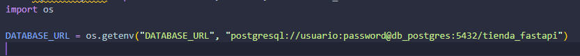
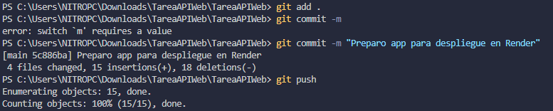

# Documentación del Despliegue en Render

## 1. Preparación del Código
He modificicado el archivo `main.py` para usar variables de entorno con `os.getenv`. Esto permite que la aplicación funcione tanto en Docker como en Render sin cambiar el código

Guardamos los cambios y lo subimos a un repositorio de github con los siguientes comandos:

## 2. Base de Datos (PostgreSQL)
1. Creamos un servicio **PostgreSQL** en Render (Plan Gratuito)
2. Obtenemos la `Internal Database URL` proporcionada por Render

## 3. Web Service (FastAPI)
Configuro un nuevo servicio web vinculado al repositorio de GitHub con los siguientes ajustes:
- **Root Directory:** `src`
- **Build Command:** `pip install -r requirements.txt`
- **Start Command:** `uvicorn main:app --host 0.0.0.0 --port $PORT`
- **Variables de Entorno:** Se configuró `DATABASE_URL` con la `Internal Database URL` que hemos obtenido antes.

## 4. Resultado
La aplicación está desplegada y accesible públicamente en:
[https://mi-tienda-fastapi.onrender.com/web]
